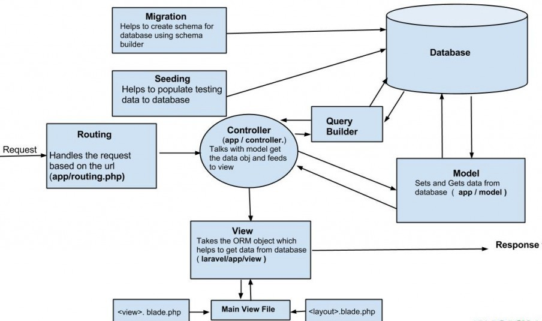

# 💊 Welcome Laravel

_Laravel, Frameworks, PHP, OOP paradigm._

## 📔 Description

This pill will serve as a first contact with the **PHP Framework Laravel**, and will consist on a _research_ section about theoretical concepts and a practical exercise with a little project to develop.

### 📂 Content

This repository contains the default Laravel application structure as per its installation.

That includes a number of files and folders under the `root` directory, having a special relevance the `app` directory, which will contain the core code of our application, and the `README.md` file (this explanatory file).

## 📋 Research

---

What is a **framework** and what **advantages** does it have?

---

In computer programming, a **software framework** is an abstraction in which software providing generic functionality can be selectively changed by additional user-written code, thus providing application-specific software.

It provides a standard way to build and deploy applications and is a universal, reusable software environment that provides particular functionality as part of a larger software platform to facilitate development of software applications, products and solutions.

Software frameworks may include support programs, compilers, code libraries, tool sets, and application programming interfaces (APIs) that bring together all the different components to enable development of a project or system.

---

What **advantages** and **disadvantages** does the **use of a framework** have?

---

Advantages:

-   **Efficiency**: Jobs that generally would take hours and hundreds of lines of code to compose, can now be done in minutes with pre-built functions. Development becomes a lot easier, so if it’s much easier it’s quicker, and subsequently effective.

-   **Security**: An extensively utilized framework has big security applications. The big benefit is the neighborhood behind it, where users end up being long-lasting testers. If you find a vulnerability or a security hole, you can go to the framework’s web site and let the team understand so they can fix it.

-   **Expense**: Most popular structures are complimentary, and considering that it likewise helps the developer to code faster, the expense for the final client will certainly be smaller.

-   **Support**: As any other distributed tool, a framework generally includes documents, a support group, or huge community online forums where you can acquire quick responses.

Disadvantages:

-   **You learn the method, not the language**: If you’re making use of a framework and you know very little about the language behind it, you will certainly find out the framework and not the language itself. The method you code jQuery is different from the way you code javascript. Simple put, if you know jQuery, it doesn’t imply you understand javascript.

-   **Restriction**: The framework’s core behaviour cannot be modified, indicating that when you utilize a framework, you are required to respect its limitations and work the way it is required. Ensure you choose a framework that fits your needs.

-   **Public**: Since the framework is readily available to everyone, it is likewise offered to people with bad intentions. It can be studied in order to know how things work and to discover flaws that can be utilized against you.

---

What is **Laravel** in general terms?

---

**Laravel** is a free, open-source PHP web framework, created by Taylor Otwell and intended for the development of web applications following the model–view–controller (MVC) architectural pattern and based on Symfony.

Some of the features of **Laravel** are a modular packaging system with a dedicated dependency manager, different ways for accessing relational databases, utilities that aid in application deployment and maintenance, and its orientation toward syntactic sugar.

The source code of **Laravel** is hosted on GitHub and licensed under the terms of MIT License.

---

What **requirements** are necessary to use **Laravel**?

---

The Laravel framework needs few requirements for getting installed on your system. A virtual machine has fulfilled each of these system requirements, **Laravel's Homestead**, hence it is a must to implement Homestead as the Laravel development environment for your local system.

Moreover, in case of not using a virtual machine, the following requirements must be fulfilled:

-   PHP >= 7.3
-   BCMath PHP Extension
-   Ctype PHP Extension
-   Fileinfo PHP extension
-   JSON PHP Extension
-   Mbstring PHP Extension
-   OpenSSL PHP Extension
-   PDO PHP Extension
-   Tokenizer PHP Extension
-   XML PHP Extension

---

What is **blade** and what is it for?

---

**Blade** is the simple, yet powerful templating engine provided with Laravel. Unlike other popular PHP templating engines, Blade does not restrict you from using plain PHP code in your views. In fact, all Blade views are compiled into plain PHP code and cached until they are modified, meaning Blade adds essentially zero overhead to your application. Blade view files use the `.blade.php` file extension and are typically stored in the `resources/views` directory.

---

What is **Artisan** and what is it used for?

---

Artisan is the command-line interface included with Laravel. It provides a number of helpful commands that can assist you while you build your application. To view a list of all available Artisan commands, you may use the `list` command:

```
php artisan list
```

---

How is **Laravel organized** at the **architecture level** by default? Briefly comment the **Laravel architecture** explaining the **directories** and **files** that you consider the **most important** and solve the following questions:

-   Where do you store **public resources** (css, js, images, etc.)?
-   Where do you store **the views**?
-   Where do you store **the drivers**?
-   Where do you store **the models**?
-   Where are the **routes stored**?

---

As mentioned previously, Laravel is an MVC framework for the development of modern web applications.

Now, here's a diagram on how this pattern is implemented within an application with Laravel:

<p align="center">
  
</p>

The application structure in Laravel is basically an skeleton of folders, sub-folders and files included by default in any project under the **root** folder, being the **app** folder the most relevant:

-   **App**: The app directory contains the core code of your application. Almost all of the classes in your application will be in here.

Where do you store **public resources** (css, js, images, etc.)?

In the **Public Directory**.

The `public` directory contains the `index.php` file, which is the entry point for all requests entering your application and configures autoloading. This directory also houses your assets such as images, JavaScript, and CSS.

Where do you store **the views**?

In the **Resources Directory**.

The `resources` directory contains your views as well as your raw, un-compiled assets such as LESS, SASS, or JavaScript. This directory also houses all of your language files.

Where do you store **the controllers**?

In the **Http Directory**, within the `app` directory.

The `Http` directory contains your controllers, middleware, and form requests. Almost all of the logic to handle requests entering your application will be placed in this directory.

Where do you store **the models**?

In the **Models Directory**, within the `app` directory.

The `Models` directory contains all of your Eloquent model classes. The Eloquent ORM included with Laravel provides a beautiful, simple ActiveRecord implementation for working with your database. Each database table has a corresponding "Model" which is used to interact with that table. Models allow you to query for data in your tables, as well as insert new records into the table.

Where are the **routes stored**?

In the **Routes Directory**.

The `routes` directory contains all of the route definitions for your application. By default, several route files are included with Laravel: `web.php`, `api.php`, `console.php` and `channels.php`.

---

What are **middlewares**?

---

**Middleware** provide a convenient mechanism for filtering HTTP requests entering your application. For example, Laravel includes a middleware that verifies the user of your application is authenticated. If the user is not authenticated, the middleware will redirect the user to the login screen. However, if the user is authenticated, the middleware will allow the request to proceed further into the application.

Additional middleware can be written to perform a variety of tasks besides authentication. A CORS middleware might be responsible for adding the proper headers to all responses leaving your application. A logging middleware might log all incoming requests to your application.

There are several middleware included in the Laravel framework, including middleware for authentication and CSRF protection. All of these middleware are located in the `app/Http/Middleware` directory.

---

What is **Eloquent** and what is it used for?

-   What is an **ORM**?
-   What **advantages** and **disadvantages** do you consider the use of an **ORM** over **SQL Queries** has?

---

One of the most important features of the Laravel framework is that it comes with a built-in ORM called **Eloquent**. Eloquent refers to an advanced implementation of the PHP Active Record Pattern, which makes it very easy to interact with application databases.

Eloquent is a very powerful yet very expressive ORM, which allows us to work with the database objects and relationships using a much more eloquent and expressive syntax. In Laravel, each database table is mappend into a corresponding Eloquent model and each of the Eloquent model objects includes various methods for retrieveing from and updating the database.

What is an **ORM**?

**Object-relational mapping** (**ORM**, **O/RM**, and **O/R mapping tool**) in computer science is a programming technique for converting data between incompatible type systems using object-oriented programming languages. This creates, in effect, a "virtual object database" that can be used from within the programming language. There are both free and commercial packages available that perform object-relational mapping, although some programmers opt to construct their own ORM tools.

What **advantages** and **disadvantages** do you consider the use of an **ORM** over **SQL Queries** has?

Advantages:

-   Models are DRY (Don't Repeat Yourself): You only write your model once, which makes it far easier to update and to maintain. All your code points to this one reference.

-   A lot of things are done for you, from handling the underlying database connection(s) to localisation.

-   SQL injection is a lot more difficult as queries are prepared and sanitised.

-   It can improve the formation of the underlying SQL. Developers can sometimes be bad at forming SQL.

-   When you change the underlying database, you do not have to rewrite code.

-   Models use OOP, which means you an extend and inherit from Models.

-   If you take the time to learn SQL queries and the theory behind it, there is nothing a Model cannot do. You can write very complex queries which have the same performance if you were to write them directly in sql, however not all developers take the time to learn SQL.

Disadvantages:

-   While many CRUD (create, read, update and delete) queries run without performance issues, more complex queries can lead to performance issues if not written properly.

-   It abstracts the database layer so if you don't have much understanding of the underpinning it can be a hindrance when something goes wrong.

-   You have to spend a bit of time learning how to use the ORM and this can have an initial impact on development. However, once you've learnt one they generally follow the same pattern.

-   Developers don't necessarily learn about SQL, which can be a massive issue if they remain ignorant.

---

What is it and how does a **log system** work?

-   Where are **logs** stored?
-   How can I **register a message** in the **log system**?
-   What types of **log messages** exist?

---

In computing, a **log file** is a file that records either events that occur in an operating system or other software runs, or messages between different users of a communication software. **Logging** is therefore the act of keeping a log. In the simplest case, messages are written to a single log file.

Many operating systems, software frameworks and programs include a **logging system**. A widely used logging standard is _syslog_, defined in Internet Engineering Task Force (IETF RFC 5424). The _syslog_ standard enables a dedicated, standardized subsystem to generate, filter, record, and analyze log messages. This relieves software developers of having to design and code their own ad hoc logging systems.

In Laravel, to help you learn more about what's happening within your application, robust logging services are provided in order to allow you to log messages to files, the system error log, and even to Slack to notify your entire team.

Where are **logs** stored?

The `logs` directory, within the **Storage Directory**, contains the application's log files.

How can I **register a message** in the **log system**?

You may write information to the logs using the `Log` facade. As previously mentioned, the logger provides the eight logging levels defined in the RFC 5424 specification: **emergency**, **alert**, **critical**, **error**, **warning**, **notice**, **info** and **debug**.

What types of **log messages** exist?

```
Log::emergency($message);
Log::alert($message);
Log::critical($message);
Log::error($message);
Log::warning($message);
Log::notice($message);
Log::info($message);
Log::debug($message);
```

So, you may call any of these methods to log a message for the corresponding level. By default, the message will be written to the default log channel as configured by your `config/logging.php` configuration file.

---

What are **migrations** and what are they used for?

---

Migrations are like version control for your database, allowing your team to modify and share the application's database schema. Migrations are typically paired with Laravel's schema builder to build your application's database schema. If you have ever had to tell a teammate to manually add a column to their local database schema, you've faced the problem that database migrations solve.

---

How does **Laravel** work with **form validation**?

---

Laravel provides several different approaches to validate your application's incoming data. By default, Laravel's base controller class uses a `ValidatesRequests` trait which provides a convenient method to validate incoming HTTP requests with a variety of powerful validation rules.

---

How do we **create** and **run tests** from **Laravel**?

---

Laravel is built with testing in mind. In fact, support for testing with PHPUnit is included out of the box and a `phpunit.xml` file is already set up for your application. The framework also ships with convenient helper methods that allow you to expressively test your applications.

By default, your application's `tests` directory contains two directories: `Feature` and `Unit`. Unit tests are tests that focus on a very small, isolated portion of your code. In fact, most unit tests probably focus on a single method. Feature tests may test a larger portion of your code, including how several objects interact with each other or even a full HTTP request to a JSON endpoint.

An `ExampleTest.php` file is provided in both the `Feature` and `Unit` test directories. After installing a new Laravel application, run `vendor/bin/phpunit` on the command line to run your tests.

---

What **surprised** you the most about **Laravel**?

---

The **extensive documentation** for all existing versions of Laravel and its **flexibility**, meaning the ability to use it not only as a backend framework, but also to develop complete fullstack apps with it.

---

What do you think about the **Laravel documentation**? Do you think it is **useful** to **work** and **learn** with?

---

Absolutely, it is indeed very useful to both learn from and work with it. You can refer to any previous version that has existed and note the differences in comparison to the latest.

However, in my opinion it lacks of some more in depth examples with real life applications built using Laravel to see its implementation.

---

Research about the **“Faker\Generator” package** and briefly explain what it is used for.

---

Faker is a PHP library that generates fake data for you. Whether you need to bootstrap your database, create good-looking XML documents, fill-in your persistence to stress test it, or anonymize data taken from a production service, Faker is for you.

---

## ✒️ Author

-   **Jorge García Torralba** &#8594; [jorge-garcia](https://code.assemblerschool.com/jorge-garcia/)
-   Followed this ***YouTube*** series by [**Traversy Media**](https://github.com/bradtraversy) as a guidance &#8594; [_Laravel From Scratch_](https://www.youtube.com/playlist?list=PLillGF-RfqbYhQsN5WMXy6VsDMKGadrJ-)
